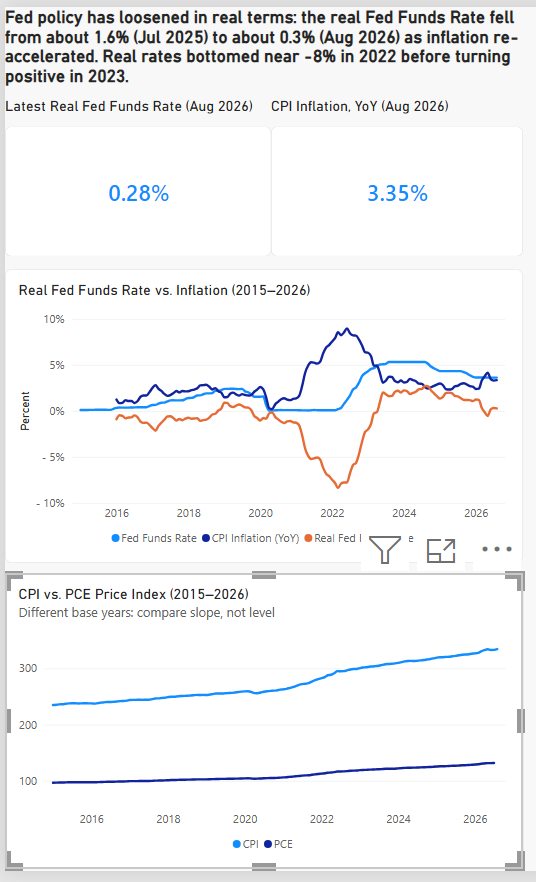

# FRED inflation and rates pipeline

An end-to-end data pipeline that pulls U.S. macroeconomic series from the FRED API, warehouses them in Snowflake with layered SQL views, and surfaces the results in a Power BI dashboard.



## Key finding

The real Fed Funds rate (nominal rate minus year-over-year CPI inflation) fell from about 1.6% in July 2025 to about 0.3% in August 2026. The nominal rate moved only from 4.33% to 3.63%, so inflation re-accelerating did most of the work. Real rates were near -8% in 2022 before turning positive in 2023.

## Architecture

FRED API → Python (`extract_fred.py`) → CSV → Snowflake raw table → transform view → analysis view → Power BI

| Layer | Object | Purpose |
|---|---|---|
| Raw | `RAW.ECON_SERIES` | Long-format observations, one row per series and date |
| Transform | `MARTS.INFLATION_RATES_MONTHLY` | Pivots to one row per month; takes the last value of each month for the daily 10-year Treasury series |
| Analysis | `MARTS.REAL_RATES_ANALYSIS` | Adds YoY CPI inflation and the real Fed Funds rate using `LAG()` |

## Data

Five FRED series from January 2015: CPI (`CPIAUCSL`), PCE price index (`PCEPI`), Fed Funds rate (`FEDFUNDS`), 10-year Treasury yield (`DGS10`), and unemployment rate (`UNRATE`). About 3,485 rows.

## Tech stack

Python (requests), SQL, Snowflake, Power BI

## Repo structure

```
scripts/     extract_fred.py, series.py
sql/         00_setup.sql, 01_transform.sql, 02_analysis.sql
dashboard/   Power BI file and preview image
data_raw.csv extracted data
```

## How to run

1. Create a virtual environment and install dependencies: `pip install requests python-dotenv`
2. Get a free API key from FRED and put it in a `.env` file: `FRED_API_KEY=your_key`
3. Run `python scripts/extract_fred.py` to produce `data_raw.csv`
4. Run `sql/00_setup.sql` in Snowflake, then load the CSV into `RAW.ECON_SERIES`
5. Run `sql/01_transform.sql` and `sql/02_analysis.sql`
6. Open the Power BI file and point it at your Snowflake account

## Data notes

- The October 2025 row has no CPI or unemployment value in the FRED data, so CPI-based lines have a small gap there.
- The latest month's CPI, PCE, and unemployment may be blank because those series are published with a lag.
- CPI and PCE use different base years, so compare their slopes, not their levels.

## Limitations

The CSV load into Snowflake is a manual step, and nothing runs on a schedule. Loading directly from Python and adding orchestration is the next step.


